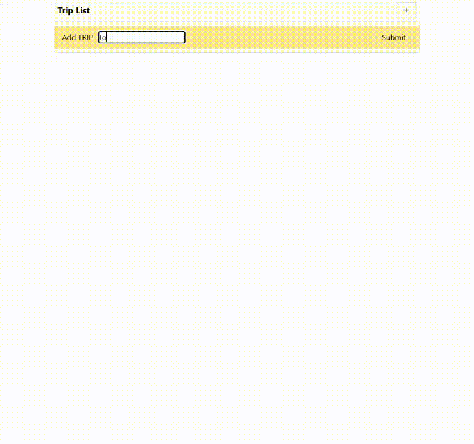

# Packing List App

A simple and structured web app to help travelers organize their trips, luggage, and items efficiently.

## 🛠️ Tech Stack

- **Frontend:** JavaScript, React, Redux Toolkit, HTML5, Tailwind CSS
- **Backend:** json-server (mock backend)

## Features

- Register multiple trips
- Add/remove different types of luggage per trip, items per luggage
- Track items stored in each piece of luggage
- Clear visual hierarchy of trips → luggage → items
- Backend simulated using json-server and RESTful API patterns

## demo

